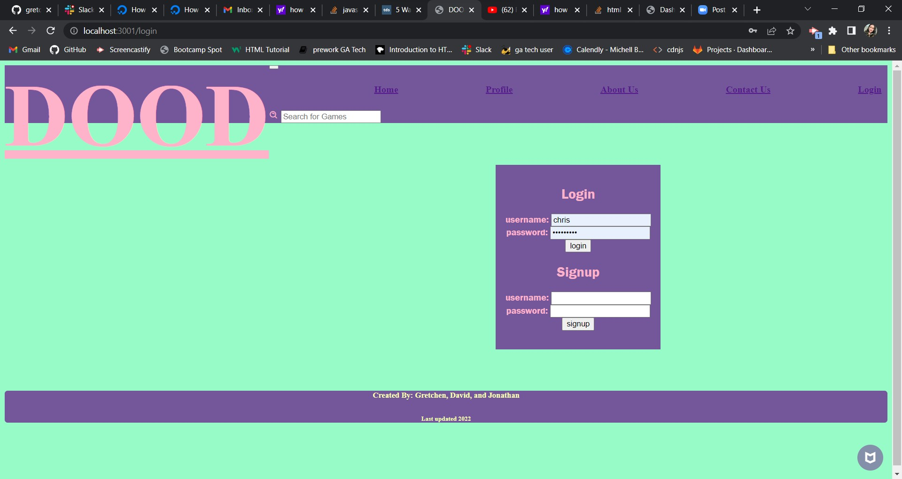
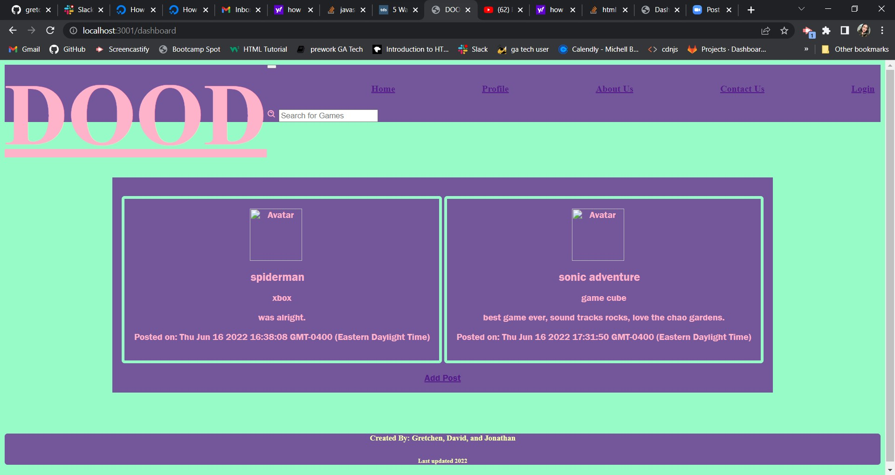

# project-2
Table of Contents
-------------------------------------------------------------------------------------------------------

 * Introduction
 * Tech
 * Installation
 * Troubleshooting
 * Contributers

 Introduction
----------------------------------------------------------------------------------------------------------

    

 * Live URL: https://glacial-badlands-86135.herokuapp.com/

 * Repo URL: https://github.com/gretchesketch/project-2

Tech
------------------------------------------------------------------------------------------

This project used the following:

 * CSS
 * Javascript
 * Node.js
 * express
 * dotenv
 * bcrypt
 * handlebars
 * mysql2
 * sequelize
 * session
 * npm install multer express morgan --save
 * schemecolor.com: retro gamer

Dependencies
--------------------------------------------------------------------------------------------
 
 * Node.js
 * express
 * dotenv
 * handlebars
 * mysql2
 * sequelize
 * bcrypt
 * session
 * multer

 Troubleshooting
----------------------------------------------------------------------------------------

* insmonia: to check that the back end was working.
* mysql workbench: to check that the data was being stored in the database.

 Contributers and contact information
----------------------------------------------------------------------------------------
 
 * Gretchen Jensen : https://github.com/gretchesketch
    -

 * David Cho : https://github.com/Aphalion13
    -

 * Jonathan Swann : https://github.com/JS19191898
    -

 
 
 